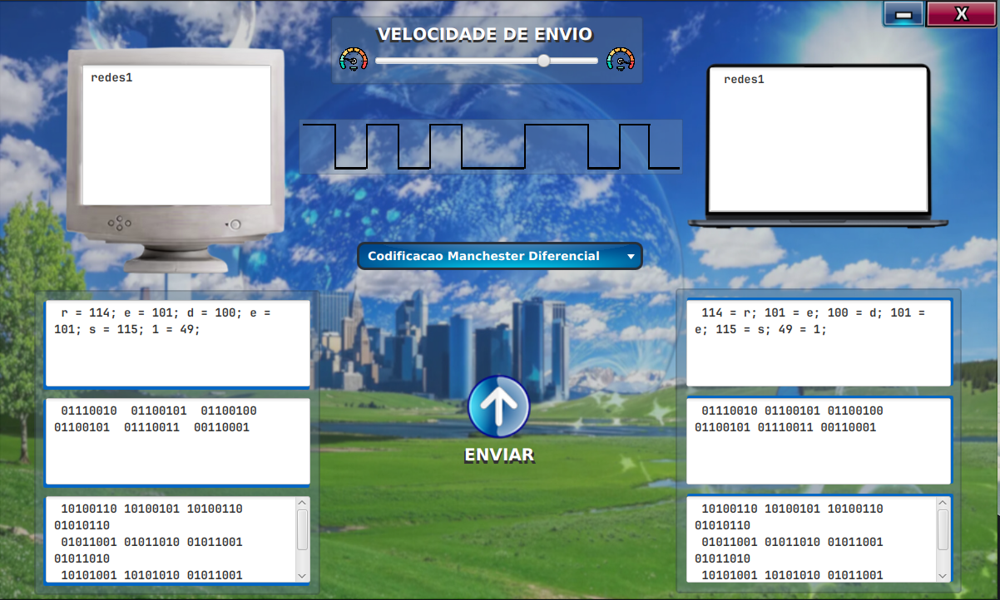

## 💻📡 Camada Frutiger - Simulação da Camada Física

Repositório para agregar o projeto de Simulação do Funcionamento da **Camada Física** em uma Rede de Computadores, desenvolvido em Java com interface gráfica em JavaFX.

O projeto tem como objetivo demonstrar, de forma prática, os processos de codificação e transmissão de dados na **Camada Física** do modelo OSI, visualizando a transformação de uma mensagem de texto em sinais elétricos.

## 🧩 Funcionalidades

- Simulação do fluxo de transmissão da Camada de Aplicação à Camada Física e vice-versa.

- Manipulação da velocidade de transmissão para observar o processo passo a passo.

- Visualização gráfica do sinal elétrico correspondente ao fluxo de bits.

- Escolha de diferentes algoritmos de codificação, incluindo:

    - Codificação Binária

    - Codificação Manchester

    - Codificação Manchester Diferencial

- Interface gráfica desenvolvida em **JavaFX**.

## 🛠️ Tecnologias Utilizadas

- **Java**

- **JavaFX**

- **Threads**

- Padrão de arquitetura **MVC (Model-View-Controller)**

## 📂 Estrutura do Projeto

```
├── assets/         # Recursos estáticos (imagens, ícones, etc.)
├── controller/     # Lógica de controle da aplicação
├── model/          # Classes de modelagem do projeto (camadas da rede)
├── util/           # Classes utilitárias
├── view/           # Marcação gráfica (FXML) e estilização (CSS)
└── Principal.java  # Classe principal de execução
```

## 🖥️ Execução

Clone este repositório:

```
git clone https://github.com/ItaloSLeao/CamadaFisica-Redes-I.git
```

Abra o projeto em um Terminal de Comandos. Compile e execute a classe Principal.java:

```java
javac Principal.java
java Principal
```

Aprecie.



## 🎓 Contexto Acadêmico

Este projeto foi desenvolvido como parte da disciplina de Redes de Computadores I, com o objetivo de aplicar e ilustrar de forma prática os conceitos de codificação de sinais da Camada Física.

## 📄 Licença

Este projeto é de uso acadêmico e está sob a licença MIT.
